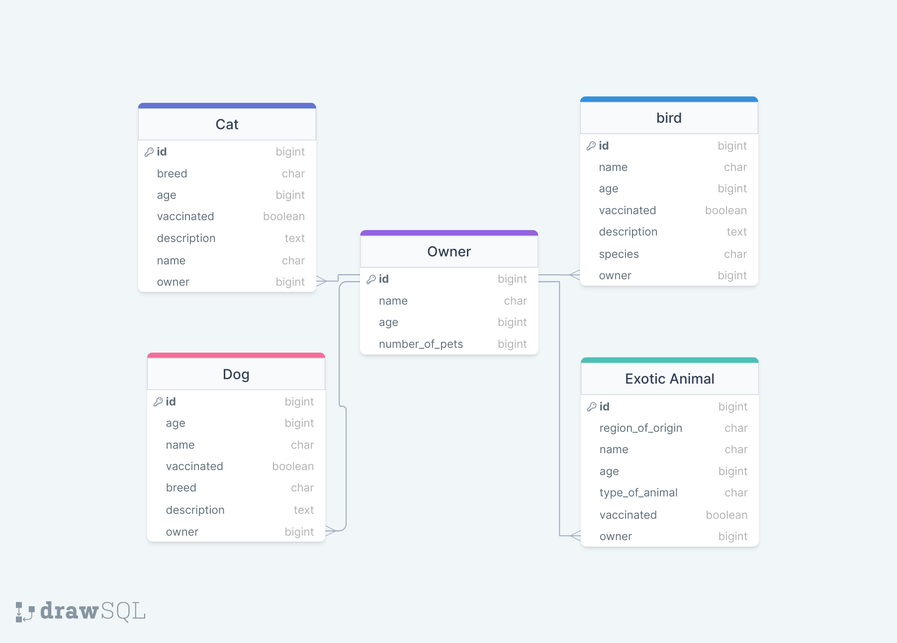

# Pets

## Assignment

In this assignment you may utilize one of your earlier created assignments (or start from scratch) and replicate the Database schema provided above. Ensure you are using the fields and validators that `BEST` fit your needs. If there are no validators that provide the functionality you are looking for, create your own.

Utilizing Postman and Django-Rest-Frameworks create a set of API Class Based Views (CBV) to fullfill the following endpoint requirements.

- `/api/v1/pets/`

> Returns all pets currently existing within our database and has the owner `name` displayed instead of the owner ID.

- `/api/v1/pets/<str:type_of_animal>/`

> Returns all existing pets pertaining to the specific animal type (i.e. Dog, Cat, Bird, Exotic)

- `/api/v1/pets/<animal_type:type_of_pet>/pet/<int:id>/`

> This `animal_type` will be a custom endpoint type that you will have to create to only accept dog, cat, bird, and exotic as arguments.
> Returns a specific pet allong with all information of their corresponding owner

- `/api/v1/owners/`

> Returns all owners and their corresponding pet names

- `api/v1/owners/<int:id>/`

> Returns one owner allong with all information of all pets

- `api/v1/owners/<int:id>/pets/<int:pet_id>/`

> Returns all information of one pet belonging to a specific owner

- **`Last but not least, ensure you are writing TESTS for models, validators, registered Enpoints, and CBV's`**
